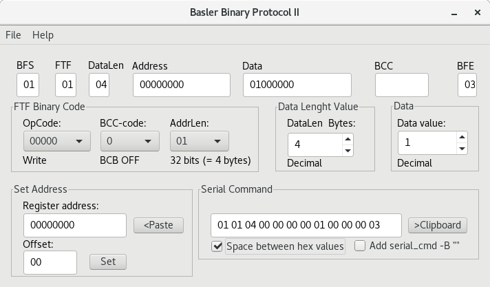

# bbp2
bbp2 - helper program to make Basler Binary Protocol version 2 serial commands. 
These commands are then again fed to compatible Basler C-Link Cameras.   
Useful when you can't use their api or compatible framegrabbers. 
Code written in Lazarus IDE.
  

 

Included is rpm made on CentOS 7
It should compile fine in Windows as well
